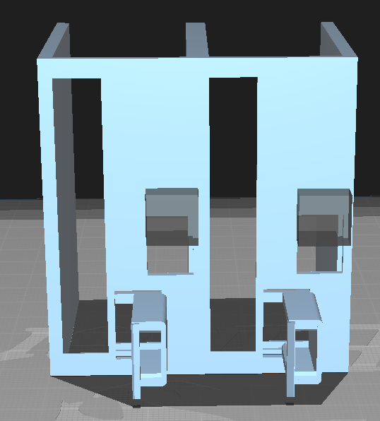

# Charging Dock for the Hyperion SlimeVR Case
---
## Summary
This was a short project I spent about 3 days on because I was procrastinating updating the firmware for my SlimeVR trackers, and it ended up turning out way better than I expected, so I decided to share the files here for everyone to be able to use and enjoy
## Printing
All files for printing can be found under the "STL Files" section of this repo. At the moment, these parts require supports to print, although I have made the amount of required supports minimal. The settings I used are as follows on my Ender 3:

(on Cura 5.2.2)
- Supports: On
  - Support Structure: Tree
  - Tree Support Branch Distance: 3.0 mm (makes sticking on the bottom less likely)
  - Support Placement: Touching Buildplate (prevents unnecessary supports, and prevents sticking on the side)
  - Support Z Distance: 0.15 mm (probably needs tuning per machine for best results)

|:exclamation: Note: I'd recommend using support blockers in some areas where supports aren't necessary, such as the access hole for the power switch and strap guide. I'd also recommend adding manual supports on the corners of the USB holders so they don't droop (see attached image)|
|---|

Print Orientation and Support blockers/additions:

---

## Making Modifications
All CAD files are provided in the repository to allow easy modification, should the existing files not match your needs for any reason. The files were generated in FreeCAD, and full disclaimer, I didn't know a ton about FreeCAD going into this, so there are some really weird parts of the layout, and poor dependency management.

## Contributing
Contributions are welcome! Feel free to fork a new version, make some changes, and create a PR to add it in, along with the changes made, and reasons for the changes. Please make all changes concise, and only change one or two specific things at a time.
